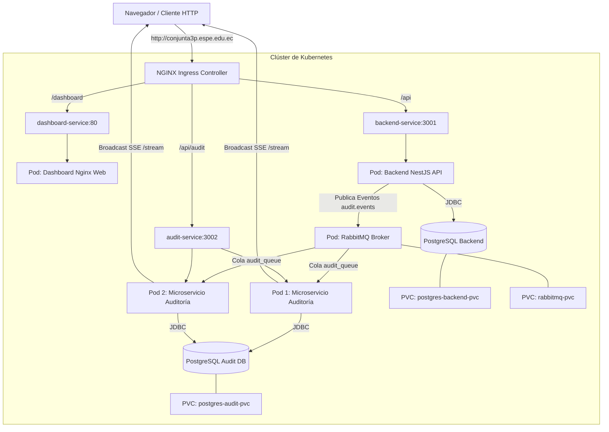

# CavaLocal — Ecosistema Distribuido, Auditoría SSE y Orquestación en Kubernetes

Este repositorio contiene la solución completa para la plataforma **CavaLocal**, empaquetada y orquestada en **Kubernetes**. Incluye el backend principal en NestJS, un microservicio de auditoría desacoplado en tiempo real mediante **RabbitMQ** y **Server-Sent Events (SSE)**, un dashboard web interactivo y la configuración completa de manifiestos YAML para Kubernetes con **NGINX Ingress Controller** bajo el dominio local **`conjunta3p.espe.edu.ec`**.

---

## 1. Arquitectura del Ecosistema



---

## 2. Requisitos Previos

Asegúrate de contar con los siguientes programas instalados en tu sistema:
- **Docker Desktop** (v20.10+)
- **Minikube** (v1.30+) o **Kind**
- **kubectl** (CLI de Kubernetes)

---

## 3. Guía de Despliegue en 15 Minutos (Paso a Paso)

### Opción A: Despliegue Automático mediante Scripts (Recomendado)

En **Linux / macOS**:
```bash
chmod +x deploy.sh destroy.sh
./deploy.sh
```

En **Windows (PowerShell)**:
```powershell
.\deploy.ps1
```

---

### Opción B: Despliegue Manual Paso a Paso

#### Paso 1: Iniciar el Clúster e Ingress Controller
```bash
minikube start --driver=docker
minikube addons enable ingress
```

#### Paso 2: Construir y Cargar las Imágenes Docker en Minikube
```bash
# Construir imágenes
docker build -t cavalocal-backend:latest ./backend
docker build -t cavalocal-audit:latest ./audit-service
docker build -t cavalocal-dashboard:latest ./web

# Cargar imágenes al clúster de Minikube
minikube image load cavalocal-backend:latest
minikube image load cavalocal-audit:latest
minikube image load cavalocal-dashboard:latest
```

#### Paso 3: Aplicar Manifiestos de Kubernetes (`/k8s`)
```bash
kubectl apply -f k8s/
```

#### Paso 4: Configurar el Dominio Local en `/etc/hosts`
1. Obtén la IP del clúster de Minikube:
   ```bash
   minikube ip
   # Ejemplo de salida: 192.168.49.2
   ```

2. Agrega la siguiente entrada al archivo de hosts de tu sistema operativo:
   - **Linux / macOS (`/etc/hosts`):**
   - **Windows (`C:\Windows\System32\drivers\etc\hosts` como Administrador):**

   ```text
   192.168.49.2   conjunta3p.espe.edu.ec
   ```

---

## 4. Estructura de Recursos en Kubernetes (`/k8s`)

| Manifiesto | Tipo de Recurso | Descripción |
|---|---|---|
| `k8s/01-configmaps-secrets.yaml` | `Secret` / `ConfigMap` | Almacena credenciales de DB, RabbitMQ, JWT y nombres de servicio en DNS K8s |
| `k8s/02-pvc.yaml` | `PersistentVolumeClaim` | 3 volúmenes persistentes de 1Gi para PostgreSQL Backend, PostgreSQL Audit y RabbitMQ |
| `k8s/03-rabbitmq.yaml` | `Deployment` / `Service` | Servidor RabbitMQ 3 Management con probes en puerto 5672 y UI en 15672 |
| `k8s/04-databases.yaml` | `Deployment` / `Service` | 2 instancias independientes de PostgreSQL 16 (`cavalocal` y `audit_db`) |
| `k8s/05-backend-deployment.yaml` | `Deployment` / `Service` | Backend NestJS (puerto 3001) con probes readiness/liveness en `/health` |
| `k8s/06-audit-deployment.yaml` | `Deployment` / `Service` | Microservicio de auditoría con **`replicas: 2`** para consumo competitivo |
| `k8s/07-dashboard-deployment.yaml` | `Deployment` / `Service` | Dashboard Web Nginx (puerto 80) con health checks |
| `k8s/08-ingress.yaml` | `Ingress` | Reglas NGINX Ingress para el dominio `conjunta3p.espe.edu.ec` |

---

## 5. Verificación, Pruebas y Escalabilidad

### 5.1. Verificar Estado de los Pods y Servicios
```bash
kubectl get pods -w
kubectl get services
kubectl get ingress
```

Todos los pods deben mostrar estado `Running` y `READY (1/1)`.

### 5.2. Verificación del Enrutamiento Ingress
Abre en tu navegador las siguientes URLs utilizando el dominio local:
- **Dashboard SSE:** [http://conjunta3p.espe.edu.ec/dashboard](http://conjunta3p.espe.edu.ec/dashboard)
- **API Auditoría REST:** [http://conjunta3p.espe.edu.ec/api/audit](http://conjunta3p.espe.edu.ec/api/audit)
- **Backend NestJS API:** [http://conjunta3p.espe.edu.ec/api](http://conjunta3p.espe.edu.ec/api)

### 5.3. Prueba de Escalabilidad Horizontal (2 Réplicas de Auditoría)
El microservicio de auditoría ya está desplegado con **2 réplicas** (`replicas: 2`). Puedes verificar el escalado y el consumo competitivo sin duplicación de mensajes con los siguientes comandos:

```bash
# Escalar a 3 réplicas si se desea probar mayor escala
kubectl scale deployment audit-deployment --replicas=3

# Consultar los logs de los pods de auditoría
kubectl logs -l app=audit-service --tail=50 -f
```

Al realizar escrituras en el backend (creación de usuarios, reservas, pagos o reseñas), RabbitMQ distribuye los mensajes entre los pods de auditoría sin duplicar ningún registro en la base de datos de auditoría.

---

## 6. Limpieza del Entorno

Para eliminar todos los recursos creados en Kubernetes:

En **Linux / macOS**:
```bash
./destroy.sh
```

En **Windows (PowerShell)**:
```powershell
.\destroy.ps1
```
